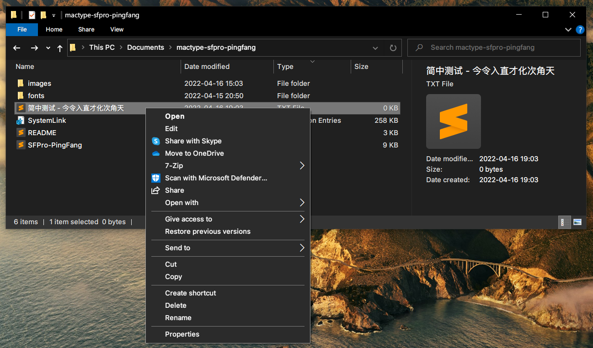

# MacType Profile - SFPro-PingFang

Replace system font with SF Pro Text and PingFang SC, the system fonts of macOS. Aim to improve the experience of text rendering for English + Simplified Chinese users on Windows.

## Usage
### Fonts
`fonts\` contains three fonts:
- `SFPFSCProDisplay\`: patched SF Pro Display with PingFang SC, suitable for font size above or equal to 20pt;
- `SFPFSCProText\`: patched SF Pro Text with PingFang SC, suitable for font size less than 20pt;
- `SFPFSCMono-Powerline\`: patched SF Pro Mono with PingFang SC and [powerline](https://github.com/powerline/powerline) symbols.

### MacType Profile
1. Install [MacType](https://github.com/snowie2000/mactype);
2. Install `fonts\SFPFSCProText.ttf` (other fonts are optional);
3. Copy `SFPro-PingFang.ini` to `%ProgramFiles%\MacType\ini\`;
4. Run MacType Wizard, select Tray mode and choose `SFPro-PingFang` as the profile.

Note: `SFPFSCProText` is chosen as the system font replacement to achieve a better viewing experience for smaller font sizes at the cost of slightly worse large fonts.

### SystemLink Registry
Run `SystemLink.reg` to set the CJK font fallback order to `Simplified Chinese -> Traditional Chinese -> Japanese -> Korean` without changing the locale.

## Showcases

### Fonts

### Applications

## Known Issues

- Some applications such as Discord, if set to launch on startup, its rendering will not be altered by MacType. Currently I'm disabling launch on startup for those applications;
- Even handled by MacType, Discord doesn't seem to be using PingFang for Simplified Chinese, but at least there's no SimSun or Meiryo in the mix and I'm happy with the experience for now;
- In browesers such as Firefox, if set the default font to SFPFSC, it will not rendering in SFPFSC, but rather fallback everything to Traditional Chinese. It's probably due to some errors when I merge the font, but I cannot figure out the problem at the moment.

Solutions or workaround for these issues is welcomed!

## TODO

Instead of merging the fonts, figure out a way to use FontLink fallback to have a more natural way of font replacement that won't get in the way of MacType. 

Alternatively, merge even more fonts (PingFang TC, PingFang HK, Hiragino Mincho) into San Fancisco to manually simulate fallback, but the font will be much less flexible to use probably.
